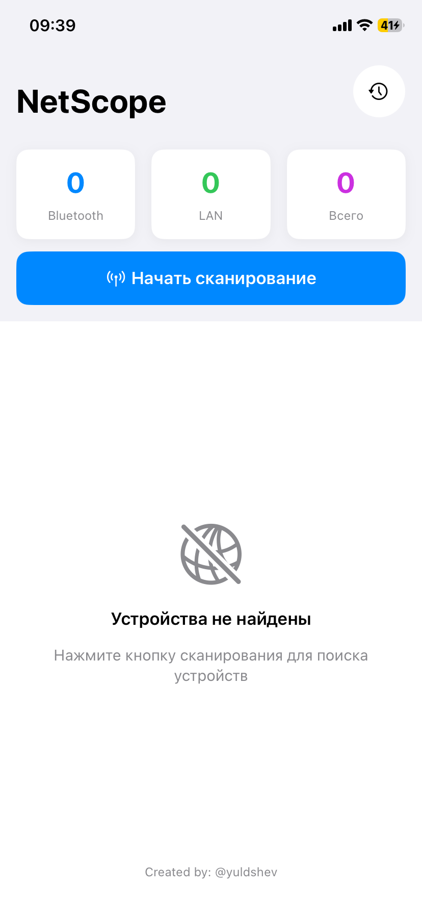
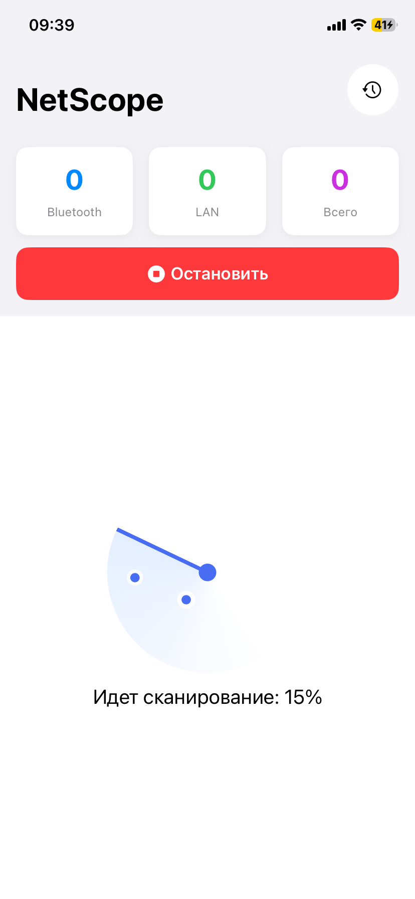
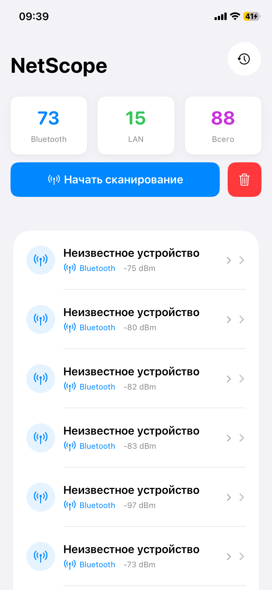
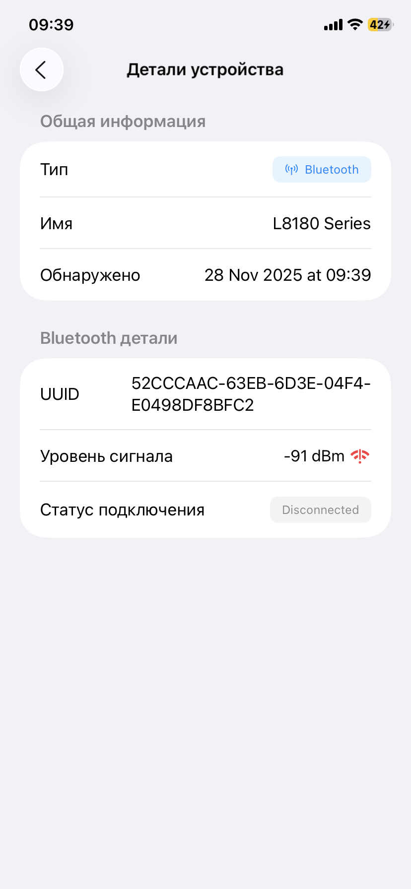
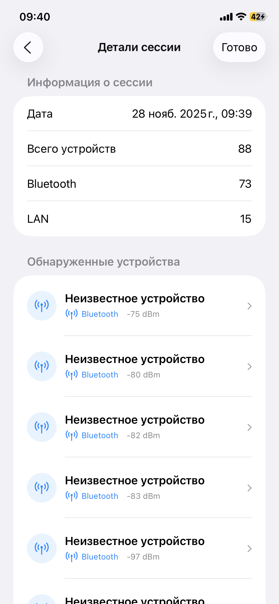
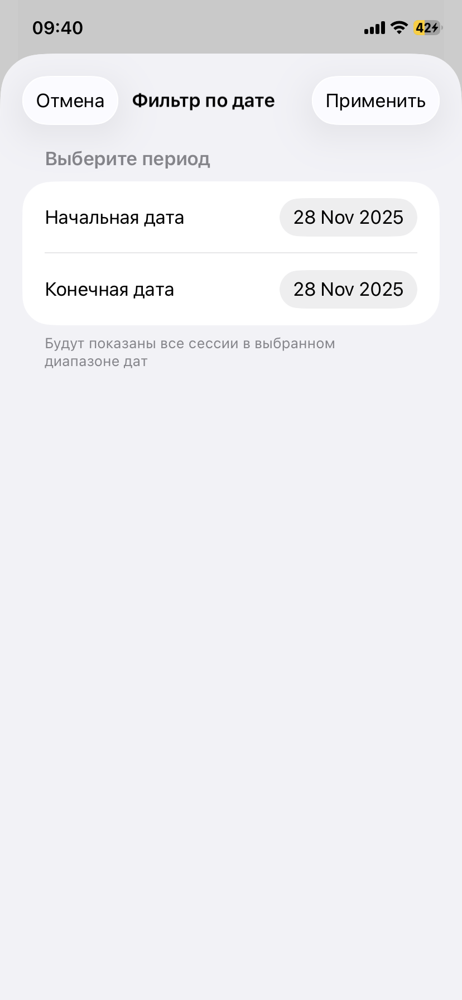
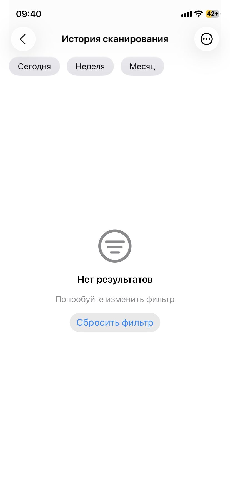

  
  <h3>NetScope</h3>
  
iOS приложение для сканирования Bluetooth и LAN устройств

  

    
    
    
    
    
  

  

    
    
  

---

  <h3>О проекте</h3>
  

    <b>NetScope</b> - тестовое приложение, разработанное для компании <b>Aezakmi Group</b>. В техническом задании требовалось использовать библиотеку <a href="https://cocoapods.org/pods/LANScanner">LanScan</a> для сканирования локальной сети. 
    Однако библиотека давно не обновлялась и вызывала проблемы при интеграции. Я мог бы исправить внутреннюю логику LanScan, но посчитал это неоправданными трудозатратами. Вместо этого я реализовал сканирование LAN-сети 
    самостоятельно — функциональность оказалась вполне решаемой без сторонних зависимостей. Также созданы unit тесты для services и viewModels
  

  

  <h3>Скрины</h3>

|  |  |  |  |
|--------|--------|--------|--------|
|  |  |  |  |

  <h3>Структура</h3>

  <pre>
    NetScope/
    ├── App/              # Entry point
    ├── Models/           # Data models
    ├── ViewModels/       # Business logic
    ├── Views/            # SwiftUI views
    ├── Services/         # BT/LAN scanning
    └── Persistence/      # CoreData stack
  </pre>

  <h3>Установка</h3>
  <pre>
    Переходим в репо: https://github.com/Yuldshev/NetScope
    Нажимаем Code → Open with Xcode → Указываем путь клонирования репо
  </pre>

